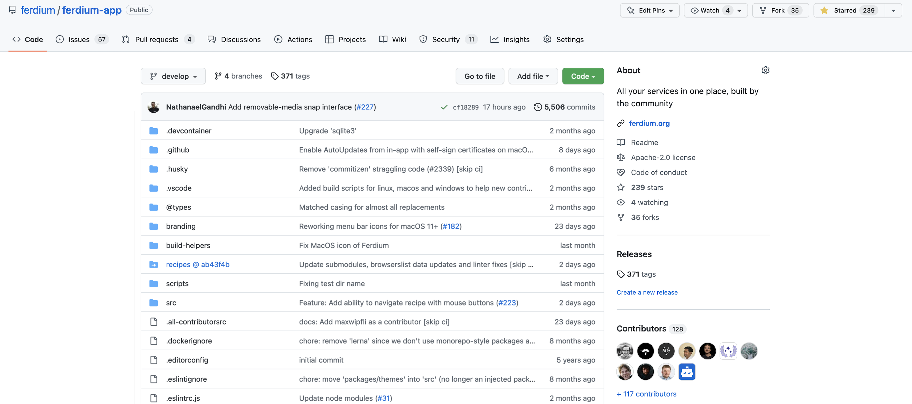
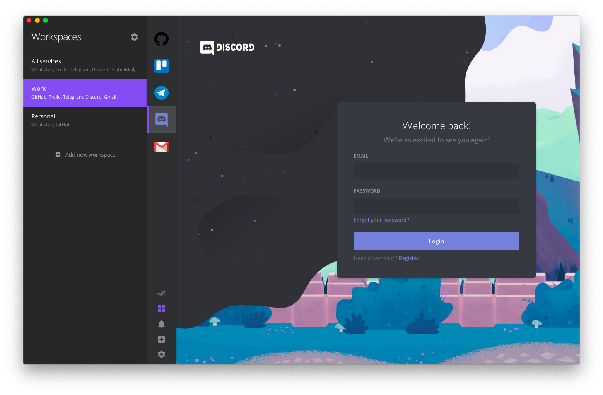
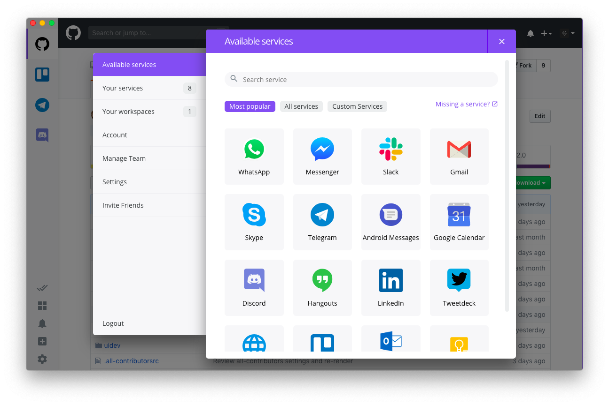

<p align="center">
    <a href="https://getferdi.com">
      
    </a>
</p>
<p align="center">
    <a href="https://getferdi.com/download">
      
    </a>
</p>

# Ferdi

<p align="center">

<!-- ALL-CONTRIBUTORS-BADGE:START - Do not remove or modify this section -->
<a href='#contributors-'></a>
<!-- ALL-CONTRIBUTORS-BADGE:END --> 
<a href="#backers-via-opencollective"></a>
<a href="#sponsors-via-opencollective"></a>
<a href="https://ci.appveyor.com/project/kytwb/ferdi"></a>
<a href="https://travis-ci.org/getferdi/ferdi"></a>
</p>

🤴🏽 Hard-fork of [Franz](https://github.com/meetfranz/franz), adding awesome features and removing unwanted ones.

### Table of contents

<details>
<summary>Toggle navigation</summary>

- [Ferdi](#ferdi)
    - [Table of contents](#table-of-contents)
    - [What is Ferdi?](#what-is-ferdi)
    - [Features](#features)
    - [What does Ferdi look like?](#what-does-ferdi-look-like)
  - [Download Ferdi](#download-ferdi)
    - [Or use homebrew (macOS only)](#or-use-homebrew-macos-only)
    - [Or use AUR (Arch Linux)](#or-use-aur-arch-linux)
  - [What makes Ferdi different from Franz?](#what-makes-ferdi-different-from-franz)
  - [Development](#development)
    - [Install OS dependencies](#install-os-dependencies)
    - [Clone repository with submodule](#clone-repository-with-submodule)
    - [Install dependencies](#install-dependencies)
    - [Fix native modules to match current electron node version](#fix-native-modules-to-match-current-electron-node-version)
    - [Start development app](#start-development-app)
    - [Packaging](#packaging)
    - [Release](#release)
  - [Contributors ✨](#contributors-)
  - [Backers via OpenCollective](#backers-via-opencollective)
  - [Sponsors via OpenCollective](#sponsors-via-opencollective)
</details>

### What is Ferdi?

Ferdi is a messaging browser that allows you to combine your favorite messaging services into one application. It is based on Franz - a software already used by thousands of people - with the difference that Ferdi gives you many additional features and doesn't restrict its usage! Ferdi is compatible with your existing Franz account so you can continue right where you left off. Find out more about Ferdi and its features on [getferdi.com](https://getferdi.com).

## Features
- [x] Ferdi puts all your messaging services into one place
- [x] Native support for 100+ services
- [x] Workspaces to keep your personal and work life separated
- [x] Support for multiple accounts on any service
- [x] Dark Mode support for all of your services
- [x] Optional cloud sync to keep your services synchronized between devices
- [x] Better control over when you get which notifications
- [x] Cross-platform so you can view your services on all your computers
- [x] Full proxy support to work in every network environment
- [x] Ferdi speaks your language: Support for 20+ languages

...and best of all:
- [x] Its completely free! There are no restrictions on features, no paywalls

### What does Ferdi look like?

<details>
<summary>Toggle screenshots</summary>
<p align="center">

<em>"Keep all your messaging services in one place."</em>

<em>"Order your services with Ferdi Workspaces."</em>

<em>"Always keep your Todos list open with Ferdi Todos."</em>

<em>"Supporting all your services."</em>
</p>
</details>

## Download Ferdi

You can download Ferdi for Windows, Mac and Linux on [Ferdi's download page](https://getferdi.com/download) or you can find all variants in the [latest stable release](https://github.com/getferdi/ferdi/releases/latest) assets and [all the other release here](https://github.com/getferdi/ferdi/releases).

### Or use homebrew (macOS only)

`$ brew cask install ferdi`

(Don't know homebrew? [brew.sh](https://brew.sh/))

### Or use AUR (Arch Linux)

Ferdi has three separate AUR packages you can use:
- **[ferdi](https://aur.archlinux.org/packages/ferdi/)**: Uses your system electron version to run the latest release - this version will work best on most systems.
- **[ferdi-bin](https://aur.archlinux.org/packages/ferdi-bin/)**: Uses the latest Fedora release and extracts it to Arch. Use this version if you are having trouble with the `ferdi` package.
- **[ferdi-git](https://aur.archlinux.org/packages/ferdi-git/)**: Uses your system electron version to run the latest commit from the develop branch and may be unstable but may also give you features that are not yet available in other versions. Please only use `ferdi-git` if you accept these risks.

If you use an AUR Helper e.g. yay, simply install it via `yay -S ferdi`.

## What makes Ferdi different from Franz?

### Removes unproductive paywalls and other other interruptions
- [x] Removes the counter-productive fullscreen app delay inviting users to upgrade
- [x] Removes pages begging you to donate after registration
- [x] Removes "Franz is better together" popup
- [x] Makes all users Premium by default ([#15](https://github.com/getferdi/ferdi/issues/15))

### Adds features to increase your productivity
- [x] Adds 30+ new services
- [x] Adds "Find in Page" feature ([#67](https://github.com/getferdi/ferdi/issues/67))
- [x] Adds an option to keep individual workspaces always loaded ([#37](https://github.com/getferdi/ferdi/issues/37))
- [x] Adds "Quick Switch" feature to help you navigate a long list of services (similar to Rambox's [Quick Switcher](https://rambox.pro/#feature-details/quick_switcher))
- [x] Adds "Service Hibernation" that will automatically unload services when they are unused to keep your computer running fast
- [x] Adds a setting to keep service in hibernation after startup ([#577](https://github.com/getferdi/ferdi/issues/577), [#584](https://github.com/getferdi/ferdi/issues/584))
- [x] [Add `user.css` and `user.js` that allows users to inject custom code into services](https://github.com/getferdi/ferdi/wiki/Using-user.css-and-user.js) ([#83](https://github.com/getferdi/ferdi/issues/83))
- [x] Adds Process Manager to find services using a lot of resources
- [x] Adds CTRL+← and CTRL+→ shortcuts and menu options to go back and forward in the service browsing history([#39](https://github.com/getferdi/ferdi/issues/39))
- [x] Adds "Scheduled Do-not-Disturb" feature in which you won't get notifications (similar to Rambox's [Work Hours](https://rambox.pro/#feature-details/work_hours))
- [x] Allows you to [use any Todo service inside "Franz Todo" panel](https://github.com/getferdi/ferdi/wiki/Custom-Todo) (e.g. Todoist via https://todoist.com/app) instead of being limited to using Franz Todo
- [x] Adds a dropdown list to choose your Todo service ([#418](https://github.com/getferdi/ferdi/issues/418), [#477](https://github.com/getferdi/ferdi/issues/477)), 💖 [@yourcontact](https://github.com/yourcontact)
- [x] Differentiates between indirect and direct notifications ([#590](https://github.com/getferdi/ferdi/issues/590)), 💖 [@Room4O4](https://github.com/Room4O4) [@mahadevans87](https://github.com/mahadevans87) [@FeikoJoosten](https://github.com/FeikoJoosten) [@sampathBlam](https://github.com/sampathBlam)

### Adds features to improve your privacy
- [x] [Adds option to change server to a custom](https://github.com/getferdi/ferdi/wiki/Custom-Server) [ferdi-server](https://github.com/getferdi/server)
- [x] Adds option to use Ferdi without an account ([#5](https://github.com/getferdi/ferdi/issues/5))
- [x] Uses the Ferdi API instead of Franz's servers
- [x] Adds "Private Notification"-Mode, that hides message content from notifications ([franz#879](https://github.com/meetfranz/franz/issues/879))
- [x] Adds Password Lock feature to keep your messages protected ([#41](https://github.com/getferdi/ferdi/issues/41), [franz#810](https://github.com/meetfranz/franz/issues/810), [franz#950](https://github.com/meetfranz/franz/issues/950), [franz#1430](https://github.com/meetfranz/franz/issues/1430))
- [x] Adds support for unlocking with Touch ID ([#367](https://github.com/getferdi/ferdi/issues/367))
- [x] Adds inactivity lock that automatically locks Ferdi after a specified amount of time ([#179](https://github.com/getferdi/ferdi/issues/179))
- [x] Adds local [recipe repository](https://github.com/getferdi/recipes) that removes the need of downloading recipes from a remote server

### Adds features to improve your experience using Ferdi
- [x] Adds Universal Dark Mode via the [DarkReader extension](https://github.com/darkreader/darkreader) ([#71](https://github.com/getferdi/ferdi/issues/71))
- [x] Adds Dark Reader settings ([#531](https://github.com/getferdi/ferdi/issues/531), [#568](https://github.com/getferdi/ferdi/issues/568)), 💖 [@Room4O4](https://github.com/Room4O4) & [@mahadevans87](https://github.com/mahadevans87)
- [x] Adds adaptable Dark Mode that will respect the system's Dark Mode setting ([#173](https://github.com/getferdi/ferdi/issues/173), [#548](https://github.com/getferdi/ferdi/issues/548) (💖 [@Room4O4](https://github.com/Room4O4) & [@mahadevans87](https://github.com/mahadevans87)))
- [x] Adds a hotkey to quickly toggle darkmode ([#530](https://github.com/getferdi/ferdi/issues/530), [#537](https://github.com/getferdi/ferdi/issues/537)), 💖 [@Room4O4](https://github.com/Room4O4) & [@mahadevans87](https://github.com/mahadevans87)
- [x] Adds an option to start Ferdi minimized ([#490](https://github.com/getferdi/ferdi/issues/490), [#534](https://github.com/getferdi/ferdi/issues/534))
- [x] Adds ability to change the services icons size and sidebar width ([#153](https://github.com/getferdi/ferdi/issues/153))
- [x] Adds an option to auto-hide the menubar ([#7](https://github.com/getferdi/ferdi/issues/7), [franz#833](https://github.com/meetfranz/franz/issues/833))
- [x] Enhances system tray icon behaviour ([#307](https://github.com/getferdi/ferdi/issues/307))
- [x] Adds option to show draggable window area on macOS ([#304](https://github.com/getferdi/ferdi/issues/304), [#532](https://github.com/getferdi/ferdi/issues/532))
- [x] Adds a notification & audio toggle action to the tray context menu ([#542](https://github.com/getferdi/ferdi/issues/542)), 💖 [@Room4O4](https://github.com/Room4O4) & [@mahadevans87](https://github.com/mahadevans87)
- [x] Adds option to show a browser-like navigation bar on all services
- [x] Adds option to change accent color
- [x] Reflects your currently opened service name to the window title to improve support for Password Managers ([#213](https://github.com/getferdi/ferdi/issues/213)), 💖 [@gmarec](https://github.com/gmarec)
- [x] Allows using SVGs for service custom icon
- [x] Adds button to open darkmode.css for a service
- [x] Improves "About Ferdi" screen to better display versions
- [x] Improves user onboarding ([#493](https://github.com/getferdi/ferdi/issues/493))
- [x] Improves "Updates" section in settings ([#506](https://github.com/getferdi/ferdi/issues/506)), 💖 [@yourcontact](https://github.com/yourcontact)
- [x] Improves draggable window area height for macOS ([#304](https://github.com/getferdi/ferdi/issues/304), [#479](https://github.com/getferdi/ferdi/issues/479))
- [x] Adds option to start Ferdi in system tray ([#331](https://github.com/getferdi/ferdi/issues/331)), 💖 [@jereksel](https://github.com/jereksel)
- [x] Fixes and enhances context menu ([#357](https://github.com/getferdi/ferdi/issues/357) [#413](https://github.com/getferdi/ferdi/issues/413) [#452](https://github.com/getferdi/ferdi/issues/452) [#354](https://github.com/getferdi/ferdi/issues/354) [#227](https://github.com/getferdi/ferdi/issues/227))
- [x] Adds better support for macOS dark mode
- [x] Adds option to disable reload of services after resuming Ferdi ([#442](https://github.com/getferdi/ferdi/issues/442)), 💖 [@n0emis](https://github.com/n0emis)
- [x] Comes with a custom branding proper to Ferdi
- [x] Adds better separation in settings
- [x] Adds various other UI improvements
- [x] Improves documentation of development so more developers can help making Ferdi even better
- [x] Updates Microsoft Teams to allow Desktop Sharing ([getferdi/recipes#116](https://github.com/getferdi/recipes/issues/116)), 💖 [@Gautasmi](https://github.com/Gautasmi)
- [x] Removes automatic reloading from WhatsApp

### Removed bugs
- [x] Fixes bug that would incorrectly display unread messages count on some services (more info in [7566ccd](https://github.com/getferdi/ferdi/commit/7566ccd))
- [x] Fixes zooming
- [x] Fixes login problems in Google services
- [x] Fixes missing Slack services custom icons ([#290](https://github.com/getferdi/ferdi/issues/290))
- [x] Fixes bug that marked valid domains as invalid ([#276](https://github.com/getferdi/ferdi/issues/276))
- [x] Fixes microphone/camera access on some versions of macOS ([#193](https://github.com/getferdi/ferdi/issues/193))
- [x] Fixes cache clearing not working in Windows 10 ([#541](https://github.com/getferdi/ferdi/issues/541), [#544](https://github.com/getferdi/ferdi/issues/544)), 💖 [@Room4O4](https://github.com/Room4O4) & [@mahadevans87](https://github.com/mahadevans87)
- [x] Fixes Home button in navigation bar not correctly navigating ([#571](https://github.com/getferdi/ferdi/issues/571), [#573](https://github.com/getferdi/ferdi/issues/573)), 💖 [@Room4O4](https://github.com/Room4O4) & [@mahadevans87](https://github.com/mahadevans87)
- [x] Fixes notifications for various services, 💖 [@FeikoJoosten](https://github.com/FeikoJoosten)
- [x] Refocuses Webview only for active service ([#610](https://github.com/getferdi/ferdi/issues/610)), 💖 [@Room4O4](https://github.com/Room4O4) & [@mahadevans87](https://github.com/mahadevans87)

### Adds new platforms
- [x] Adds portable version for Windows so you can use Ferdi without even installing it, 💖 [@Makazzz](https://github.com/Makazzz)
- [x] Adds Arch Linux AUR packages, 💖 [@AGCaesar](https://github.com/AGCaesar)
- [x] Adds Ferdi as a Flatpak on Flathub ([#323](https://github.com/getferdi/ferdi/issues/323)), 💖 [@lhw](https://github.com/lhw)

### Adds internal changes
- [x] Upgrades to Electron 8.1.1
- [x] Switches to [`electron-spellchecker`](https://github.com/electron-userland/electron-spellchecker) to improve application size
- [x] Minifies build files to improve app size
- [x] Adds "npm run prepare-code" command for development to lint and beautify code
- [x] Adds "npm run link-readme" command to automatically add links to issues and users inside README.md
- [x] Fixes incorrect body closing tag ([#330](https://github.com/getferdi/ferdi/issues/330)), 💖 [@jereksel](https://github.com/jereksel)
- [x] Uses CrowdIn to improve i18n
- [x] Adds retry commands to flaky build steps ([#498](https://github.com/getferdi/ferdi/issues/498))
- [x] Runs utility scripts pre-commit instead of pre-push ([#515](https://github.com/getferdi/ferdi/issues/515))

> Thanks to all our [contributors](#contributors-) who helped realize all these amazing features! 💖 

## Development

### Install OS dependencies

#### Node.js

Please make sure you are running NodeJS v10 or above.

#### Git

The version [2.23.0](https://github.com/git-for-windows/git/releases/tag/v2.23.0.windows.1) for Git is working fine for development. You can then use the console from Git to do the development procedure.

#### Debian/Ubuntu

```bash
$ apt install libx11-dev libxext-dev libxss-dev libxkbfile-dev
```

#### Fedora

```bash
$ dnf install libX11-devel libXext-devel libXScrnSaver-devel libxkbfile-devel
```

#### Windows

```bash
$ npm install --global windows-build-tools --vs2015
```

### Clone repository with submodule

```bash
$ git clone https://github.com/getferdi/ferdi.git
$ cd ferdi
$ git submodule update --init --recursive
```

It is important you execute the last command to get the required submodules (recipes, server).

### Install dependencies

Run the following command to install all dependencies, and link sibling modules with Ferdi.

```bash
$ npx lerna bootstrap
```

If you previously ran `npm install` it sometimes is necessary to delete your `node_modules` folder before running `npx lerna bootstrap`. If you encounter the `gyp: No Xcode or CLT version` error on macOS at this step, please have a look [here](https://medium.com/flawless-app-stories/gyp-no-xcode-or-clt-version-detected-macos-catalina-anansewaa-38b536389e8d).

### Fix native modules to match current electron node version

```bash
$ npm run rebuild
```

### Start development app

Run these two commands **simultaneously** in different terminals:

```bash
$ npm run dev
$ DEBUG=Ferdi:* npm run start
```

Optionally, you can run both commands in one terminal with [misty](https://github.com/adlk/misty) (see [misty.yml](https://github.com/getferdi/ferdi/blob/develop/misty.yml)):

```bash
$ DEBUG=Ferdi:* npx misty
```

Note: please prefer [`debug()`](https://github.com/visionmedia/debug) over `console.log()`.

### Packaging

```bash
$ npm run build
```

Deliverables will be available in the `out` folder.

### Release

Create a new [draft release](https://github.com/getferdi/ferdi/releases/new) that targets the `release` branch, then:

```bash
$ git checkout develop && git pull
$ git checkout release
$ git submodule update --remote --force
$ git add .
$ git commit -m "Update submodules"
$ git merge --no-ff develop
$ git push
```

Once the draft release assets are uploaded (13 assets), publish the release. The last commit of the `release` branch will be tagged. You can then merge `release` into `master` and back into `develop` if needed.

#### Nightly

```bash
$ git checkout develop && git pull
$ git checkout nightly
$ git submodule update --remote --force
$ git add .
$ git commit -m "Update submodules"
$ git merge --no-ff develop
$ git push
```

The draft release and assets will be available in [getferdi/nightlies releases](https://github.com/getferdi/nightlies/releases). You need to manually publish the draft release as a pre-release for now.

## Contributors ✨

Thanks goes to these wonderful people ([emoji key](https://allcontributors.org/docs/en/emoji-key)):

<!-- ALL-CONTRIBUTORS-LIST:START - Do not remove or modify this section -->
<!-- prettier-ignore-start -->
<!-- markdownlint-disable -->
<table>
  <tr>
    <td align="center"><a href="https://vantezzen.io"><br /><sub><b>Bennett</b></sub></a><br /><a href="https://github.com/getferdi/ferdi/commits?author=vantezzen" title="Code">💻</a> <a href="#design-vantezzen" title="Design">🎨</a> <a href="https://github.com/getferdi/ferdi/commits?author=vantezzen" title="Documentation">📖</a> <a href="#ideas-vantezzen" title="Ideas, Planning, & Feedback">🤔</a> <a href="#translation-vantezzen" title="Translation">🌍</a> <a href="#example-vantezzen" title="Examples">💡</a> <a href="https://github.com/getferdi/ferdi/issues?q=author%3Avantezzen" title="Bug reports">🐛</a> <a href="#content-vantezzen" title="Content">🖋</a> <a href="#infra-vantezzen" title="Infrastructure (Hosting, Build-Tools, etc)">🚇</a> <a href="#userTesting-vantezzen" title="User Testing">📓</a> <a href="#question-vantezzen" title="Answering Questions">💬</a> <a href="#projectManagement-vantezzen" title="Project Management">📆</a> <a href="https://github.com/getferdi/ferdi/pulls?q=is%3Apr+reviewed-by%3Avantezzen" title="Reviewed Pull Requests">👀</a></td>
    <td align="center"><a href="https://twitter.com/kytwb"><br /><sub><b>Amine Mouafik</b></sub></a><br /><a href="https://github.com/getferdi/ferdi/commits?author=kytwb" title="Code">💻</a> <a href="#design-kytwb" title="Design">🎨</a> <a href="https://github.com/getferdi/ferdi/commits?author=kytwb" title="Documentation">📖</a> <a href="#ideas-kytwb" title="Ideas, Planning, & Feedback">🤔</a> <a href="https://github.com/getferdi/ferdi/issues?q=author%3Akytwb" title="Bug reports">🐛</a> <a href="#content-kytwb" title="Content">🖋</a> <a href="#infra-kytwb" title="Infrastructure (Hosting, Build-Tools, etc)">🚇</a> <a href="#userTesting-kytwb" title="User Testing">📓</a> <a href="#question-kytwb" title="Answering Questions">💬</a> <a href="#projectManagement-kytwb" title="Project Management">📆</a> <a href="https://github.com/getferdi/ferdi/pulls?q=is%3Apr+reviewed-by%3Akytwb" title="Reviewed Pull Requests">👀</a> <a href="#maintenance-kytwb" title="Maintenance">🚧</a> <a href="#platform-kytwb" title="Packaging/porting to new platform">📦</a> <a href="#fundingFinding-kytwb" title="Funding Finding">🔍</a> <a href="#blog-kytwb" title="Blogposts">📝</a> <a href="#translation-kytwb" title="Translation">🌍</a></td>
    <td align="center"><a href="http://www.adlk.io"><br /><sub><b>Stefan Malzner</b></sub></a><br /><a href="https://github.com/getferdi/ferdi/commits?author=adlk" title="Code">💻</a> <a href="#content-adlk" title="Content">🖋</a> <a href="#design-adlk" title="Design">🎨</a> <a href="https://github.com/getferdi/ferdi/commits?author=adlk" title="Documentation">📖</a> <a href="#ideas-adlk" title="Ideas, Planning, & Feedback">🤔</a> <a href="#infra-adlk" title="Infrastructure (Hosting, Build-Tools, etc)">🚇</a> <a href="#projectManagement-adlk" title="Project Management">📆</a> <a href="https://github.com/getferdi/ferdi/commits?author=adlk" title="Tests">⚠️</a> <a href="#translation-adlk" title="Translation">🌍</a></td>
    <td align="center"><a href="https://github.com/Makazzz"><br /><sub><b>Makazzz</b></sub></a><br /><a href="https://github.com/getferdi/ferdi/issues?q=author%3AMakazzz" title="Bug reports">🐛</a> <a href="https://github.com/getferdi/ferdi/commits?author=Makazzz" title="Code">💻</a> <a href="#translation-Makazzz" title="Translation">🌍</a> <a href="#content-Makazzz" title="Content">🖋</a> <a href="https://github.com/getferdi/ferdi/commits?author=Makazzz" title="Documentation">📖</a> <a href="#platform-Makazzz" title="Packaging/porting to new platform">📦</a></td>
    <td align="center"><a href="http://seriesgt.com"><br /><sub><b>ZeroCool</b></sub></a><br /><a href="https://github.com/getferdi/ferdi/commits?author=ZeroCool940711" title="Code">💻</a> <a href="#ideas-ZeroCool940711" title="Ideas, Planning, & Feedback">🤔</a></td>
    <td align="center"><a href="https://github.com/rseitbekov"><br /><sub><b>rseitbekov</b></sub></a><br /><a href="https://github.com/getferdi/ferdi/commits?author=rseitbekov" title="Code">💻</a></td>
  </tr>
  <tr>
    <td align="center"><a href="https://djangogigs.com/developers/peter-bittner/"><br /><sub><b>Peter Bittner</b></sub></a><br /><a href="#ideas-bittner" title="Ideas, Planning, & Feedback">🤔</a> <a href="https://github.com/getferdi/ferdi/issues?q=author%3Abittner" title="Bug reports">🐛</a></td>
    <td align="center"><a href="https://github.com/justus-saul"><br /><sub><b>Justus Saul</b></sub></a><br /><a href="https://github.com/getferdi/ferdi/issues?q=author%3Ajustus-saul" title="Bug reports">🐛</a> <a href="#ideas-justus-saul" title="Ideas, Planning, & Feedback">🤔</a></td>
    <td align="center"><a href="https://github.com/igreil"><br /><sub><b>igreil</b></sub></a><br /><a href="#ideas-igreil" title="Ideas, Planning, & Feedback">🤔</a></td>
    <td align="center"><a href="http://marcolopes.eu"><br /><sub><b>Marco Lopes</b></sub></a><br /><a href="#ideas-marcolopes" title="Ideas, Planning, & Feedback">🤔</a></td>
    <td align="center"><a href="https://github.com/dayzlun"><br /><sub><b>dayzlun</b></sub></a><br /><a href="https://github.com/getferdi/ferdi/issues?q=author%3Adayzlun" title="Bug reports">🐛</a></td>
    <td align="center"><a href="https://twitter.com/tobigue_"><br /><sub><b>Tobias Günther</b></sub></a><br /><a href="#ideas-tobigue" title="Ideas, Planning, & Feedback">🤔</a></td>
  </tr>
  <tr>
    <td align="center"><a href="https://github.com/AGCaesar"><br /><sub><b>AGCaesar</b></sub></a><br /><a href="#platform-AGCaesar" title="Packaging/porting to new platform">📦</a></td>
    <td align="center"><a href="https://github.com/xthursdayx"><br /><sub><b>xthursdayx</b></sub></a><br /><a href="https://github.com/getferdi/ferdi/commits?author=xthursdayx" title="Code">💻</a> <a href="https://github.com/getferdi/ferdi/commits?author=xthursdayx" title="Documentation">📖</a> <a href="#infra-xthursdayx" title="Infrastructure (Hosting, Build-Tools, etc)">🚇</a> <a href="#platform-xthursdayx" title="Packaging/porting to new platform">📦</a></td>
    <td align="center"><a href="https://github.com/Gaboris"><br /><sub><b>Gaboris</b></sub></a><br /><a href="#question-Gaboris" title="Answering Questions">💬</a> <a href="https://github.com/getferdi/ferdi/issues?q=author%3AGaboris" title="Bug reports">🐛</a></td>
    <td align="center"><a href="http://www.cu3ed.com/"><br /><sub><b>Ce</b></sub></a><br /><a href="https://github.com/getferdi/ferdi/issues?q=author%3Aincace" title="Bug reports">🐛</a></td>
    <td align="center"><a href="http://pztrn.name/"><br /><sub><b>Stanislav N.</b></sub></a><br /><a href="https://github.com/getferdi/ferdi/issues?q=author%3Apztrn" title="Bug reports">🐛</a></td>
    <td align="center"><a href="http://www.patrickcurl.com"><br /><sub><b>Patrick Curl</b></sub></a><br /><a href="#ideas-patrickcurl" title="Ideas, Planning, & Feedback">🤔</a></td>
  </tr>
  <tr>
    <td align="center"><a href="https://github.com/Stanzilla"><br /><sub><b>Benjamin Staneck</b></sub></a><br /><a href="#design-Stanzilla" title="Design">🎨</a></td>
    <td align="center"><a href="https://github.com/ammarmalhas"><br /><sub><b>ammarmalhas</b></sub></a><br /><a href="https://github.com/getferdi/ferdi/issues?q=author%3Aammarmalhas" title="Bug reports">🐛</a> <a href="#security-ammarmalhas" title="Security">🛡️</a></td>
    <td align="center"><a href="https://github.com/steliyan"><br /><sub><b>Steliyan Stoyanov</b></sub></a><br /><a href="https://github.com/getferdi/ferdi/commits?author=steliyan" title="Code">💻</a> <a href="#ideas-steliyan" title="Ideas, Planning, & Feedback">🤔</a></td>
    <td align="center"><a href="https://github.com/brorbw"><br /><sub><b>Bror Winther</b></sub></a><br /><a href="https://github.com/getferdi/ferdi/commits?author=brorbw" title="Documentation">📖</a></td>
    <td align="center"><a href="https://fwdekker.com/"><br /><sub><b>Felix W. Dekker</b></sub></a><br /><a href="https://github.com/getferdi/ferdi/commits?author=FWDekker" title="Documentation">📖</a></td>
    <td align="center"><a href="https://github.com/Sauceee"><br /><sub><b>Sauceee</b></sub></a><br /><a href="#design-Sauceee" title="Design">🎨</a></td>
  </tr>
  <tr>
    <td align="center"><a href="http://lhw.ring0.de"><br /><sub><b>Lennart Weller</b></sub></a><br /><a href="#platform-lhw" title="Packaging/porting to new platform">📦</a></td>
    <td align="center"><a href="https://github.com/jereksel"><br /><sub><b>Andrzej Ressel</b></sub></a><br /><a href="https://github.com/getferdi/ferdi/commits?author=jereksel" title="Code">💻</a></td>
    <td align="center"><a href="https://gitlab.com/dpeukert"><br /><sub><b>Daniel Peukert</b></sub></a><br /><a href="https://github.com/getferdi/ferdi/commits?author=dpeukert" title="Code">💻</a></td>
    <td align="center"><a href="https://crowdin.com/profile/Ali_Shiple"><br /><sub><b>Ali M. Shiple</b></sub></a><br /><a href="#translation-Ali_Shiple" title="Translation">🌍</a></td>
    <td align="center"><a href="https://crowdin.com/profile/elviseras"><br /><sub><b>elviseras</b></sub></a><br /><a href="#translation-elviseras" title="Translation">🌍</a></td>
    <td align="center"><a href="https://crowdin.com/profile/J370"><br /><sub><b>J370</b></sub></a><br /><a href="#translation-J370" title="Translation">🌍</a></td>
  </tr>
  <tr>
    <td align="center"><a href="https://crowdin.com/profile/keunes"><br /><sub><b>Koen</b></sub></a><br /><a href="#translation-keunes" title="Translation">🌍</a></td>
    <td align="center"><a href="https://crowdin.com/profile/leandrogehlen"><br /><sub><b>Leandro Gehlen</b></sub></a><br /><a href="#translation-leandrogehlen" title="Translation">🌍</a></td>
    <td align="center"><a href="https://crowdin.com/profile/Matthieu42"><br /><sub><b>Matthieu42</b></sub></a><br /><a href="#translation-Matthieu42" title="Translation">🌍</a></td>
    <td align="center"><a href="https://crowdin.com/profile/nicky18013"><br /><sub><b>Nikita Bibanaev</b></sub></a><br /><a href="#translation-nicky18013" title="Translation">🌍</a></td>
    <td align="center"><a href="https://crowdin.com/profile/Tatjana1998"><br /><sub><b>Tatjana1998</b></sub></a><br /><a href="#translation-Tatjana1998" title="Translation">🌍</a></td>
    <td align="center"><a href="https://crowdin.com/profile/seayko"><br /><sub><b>tinect</b></sub></a><br /><a href="#translation-seayko" title="Translation">🌍</a></td>
  </tr>
  <tr>
    <td align="center"><a href="https://crowdin.com/profile/Pusnow"><br /><sub><b>Wonsup Yoon</b></sub></a><br /><a href="#translation-Pusnow" title="Translation">🌍</a></td>
    <td align="center"><a href="https://crowdin.com/profile/zutt"><br /><sub><b>zutt</b></sub></a><br /><a href="#translation-zutt" title="Translation">🌍</a></td>
    <td align="center"><a href="http://twitter.com/noemis_exec"><br /><sub><b>n0emis</b></sub></a><br /><a href="https://github.com/getferdi/ferdi/commits?author=n0emis" title="Code">💻</a> <a href="#translation-n0emis" title="Translation">🌍</a></td>
    <td align="center"><a href="https://www.monke-agency.com/equipe.html"><br /><sub><b>gmarec</b></sub></a><br /><a href="https://github.com/getferdi/ferdi/commits?author=gmarec" title="Code">💻</a></td>
    <td align="center"><a href="https://crowdin.com/profile/127oo1"><br /><sub><b>127oo1</b></sub></a><br /><a href="#translation-127oo1" title="Translation">🌍</a></td>
    <td align="center"><a href="https://crowdin.com/profile/ChTBoner"><br /><sub><b>ChTBoner</b></sub></a><br /><a href="#translation-ChTBoner" title="Translation">🌍</a></td>
  </tr>
  <tr>
    <td align="center"><a href="https://crowdin.com/profile/johanengstrand"><br /><sub><b>Johan Engstrand</b></sub></a><br /><a href="#translation-johanengstrand" title="Translation">🌍</a></td>
    <td align="center"><a href="https://mrassili.com"><br /><sub><b>Marouane R</b></sub></a><br /><a href="https://github.com/getferdi/ferdi/commits?author=mrassili" title="Code">💻</a></td>
    <td align="center"><a href="https://github.com/yourcontact"><br /><sub><b>Roman</b></sub></a><br /><a href="https://github.com/getferdi/ferdi/commits?author=yourcontact" title="Code">💻</a> <a href="#ideas-yourcontact" title="Ideas, Planning, & Feedback">🤔</a></td>
    <td align="center"><a href="https://github.com/mahadevans87"><br /><sub><b>Mahadevan Sreenivasan</b></sub></a><br /><a href="https://github.com/getferdi/ferdi/commits?author=mahadevans87" title="Code">💻</a> <a href="#ideas-mahadevans87" title="Ideas, Planning, & Feedback">🤔</a> <a href="https://github.com/getferdi/ferdi/pulls?q=is%3Apr+reviewed-by%3Amahadevans87" title="Reviewed Pull Requests">👀</a> <a href="https://github.com/getferdi/ferdi/issues?q=author%3Amahadevans87" title="Bug reports">🐛</a> <a href="https://github.com/getferdi/ferdi/commits?author=mahadevans87" title="Documentation">📖</a> <a href="#userTesting-mahadevans87" title="User Testing">📓</a></td>
    <td align="center"><a href="https://jakelee.co.uk"><br /><sub><b>Jake Lee</b></sub></a><br /><a href="#content-JakeSteam" title="Content">🖋</a></td>
    <td align="center"><a href="https://github.com/sampathBlam"><br /><sub><b>Sampath Kumar Krishnan</b></sub></a><br /><a href="https://github.com/getferdi/ferdi/commits?author=sampathBlam" title="Code">💻</a> <a href="https://github.com/getferdi/ferdi/pulls?q=is%3Apr+reviewed-by%3AsampathBlam" title="Reviewed Pull Requests">👀</a> <a href="#ideas-sampathBlam" title="Ideas, Planning, & Feedback">🤔</a> <a href="https://github.com/getferdi/ferdi/issues?q=author%3AsampathBlam" title="Bug reports">🐛</a> <a href="https://github.com/getferdi/ferdi/commits?author=sampathBlam" title="Documentation">📖</a> <a href="#userTesting-sampathBlam" title="User Testing">📓</a></td>
  </tr>
  <tr>
    <td align="center"><a href="https://github.com/saruwman"><br /><sub><b>saruwman</b></sub></a><br /><a href="https://github.com/getferdi/ferdi/commits?author=saruwman" title="Documentation">📖</a> <a href="https://github.com/getferdi/ferdi/commits?author=saruwman" title="Code">💻</a></td>
    <td align="center"><a href="https://github.com/dorukkarinca"><br /><sub><b>dorukkarinca</b></sub></a><br /><a href="https://github.com/getferdi/ferdi/issues?q=author%3Adorukkarinca" title="Bug reports">🐛</a></td>
    <td align="center"><a href="https://www.linkedin.com/in/gautamsi"><br /><sub><b>Gautam Singh</b></sub></a><br /><a href="https://github.com/getferdi/ferdi/commits?author=gautamsi" title="Code">💻</a></td>
    <td align="center"><a href="https://feikojoosten.com"><br /><sub><b>Feiko Joosten</b></sub></a><br /><a href="https://github.com/getferdi/ferdi/commits?author=FeikoJoosten" title="Code">💻</a></td>
    <td align="center"><a href="https://crowdin.com/profile/2bdelghafour"><br /><sub><b>2bdelghafour</b></sub></a><br /><a href="#translation-2bdelghafour" title="Translation">🌍</a></td>
    <td align="center"><a href="https://crowdin.com/profile/abdoutanta"><br /><sub><b>Abderrahim Tantaoui</b></sub></a><br /><a href="#translation-abdoutanta" title="Translation">🌍</a></td>
  </tr>
  <tr>
    <td align="center"><a href="https://crowdin.com/profile/AndiLeni"><br /><sub><b>AndiLeni</b></sub></a><br /><a href="#translation-AndiLeni" title="Translation">🌍</a></td>
    <td align="center"><a href="https://crowdin.com/profile/brunofalmada"><br /><sub><b>Bruno Almada</b></sub></a><br /><a href="#translation-brunofalmada" title="Translation">🌍</a></td>
    <td align="center"><a href="https://crowdin.com/profile/Catarino"><br /><sub><b>Catarino Gonçalo</b></sub></a><br /><a href="#translation-Catarino" title="Translation">🌍</a></td>
    <td align="center"><a href="https://crowdin.com/profile/Alzemand"><br /><sub><b>Edilson Alzemand Sigmaringa Junior</b></sub></a><br /><a href="#translation-Alzemand" title="Translation">🌍</a></td>
    <td align="center"><a href="https://crowdin.com/profile/MAT-OUT"><br /><sub><b>MAT-OUT</b></sub></a><br /><a href="#translation-MAT-OUT" title="Translation">🌍</a></td>
    <td align="center"><a href="https://crowdin.com/profile/mazzo98"><br /><sub><b>mazzo98</b></sub></a><br /><a href="#translation-mazzo98" title="Translation">🌍</a></td>
  </tr>
  <tr>
    <td align="center"><a href="https://crowdin.com/profile/paprika-naught-tiffin-flyspeck"><br /><sub><b>paprika-naught-tiffin-flyspeck</b></sub></a><br /><a href="#translation-paprika-naught-tiffin-flyspeck" title="Translation">🌍</a></td>
    <td align="center"><a href="https://crowdin.com/profile/patrickvalle"><br /><sub><b>Patrick Valle</b></sub></a><br /><a href="#translation-patrickvalle" title="Translation">🌍</a></td>
    <td align="center"><a href="https://crowdin.com/profile/peq42"><br /><sub><b>peq42_</b></sub></a><br /><a href="#translation-peq42" title="Translation">🌍</a></td>
    <td align="center"><a href="https://crowdin.com/profile/karlinhos"><br /><sub><b>Pumbinha</b></sub></a><br /><a href="#translation-karlinhos" title="Translation">🌍</a></td>
    <td align="center"><a href="https://crowdin.com/profile/dies"><br /><sub><b>Serhiy Dmytryshyn</b></sub></a><br /><a href="#translation-dies" title="Translation">🌍</a></td>
    <td align="center"><a href="https://crowdin.com/profile/SMile61"><br /><sub><b>SMile61</b></sub></a><br /><a href="#translation-SMile61" title="Translation">🌍</a></td>
  </tr>
  <tr>
    <td align="center"><a href="https://crowdin.com/profile/tinect"><br /><sub><b>tinect</b></sub></a><br /><a href="#translation-tinect" title="Translation">🌍</a></td>
    <td align="center"><a href="https://github.com/gega7"><br /><sub><b>gega7</b></sub></a><br /><a href="https://github.com/getferdi/ferdi/issues?q=author%3Agega7" title="Bug reports">🐛</a></td>
    <td align="center"><a href="https://github.com/tristanplouz"><br /><sub><b>tristanplouz</b></sub></a><br /><a href="https://github.com/getferdi/ferdi/commits?author=tristanplouz" title="Code">💻</a> <a href="#ideas-tristanplouz" title="Ideas, Planning, & Feedback">🤔</a></td>
    <td align="center"><a href="https://github.com/dannyqiu"><br /><sub><b>Danny Qiu</b></sub></a><br /><a href="https://github.com/getferdi/ferdi/commits?author=dannyqiu" title="Code">💻</a> <a href="https://github.com/getferdi/ferdi/issues?q=author%3Adannyqiu" title="Bug reports">🐛</a></td>
    <td align="center"><a href="https://github.com/belyazidi56"><br /><sub><b>Youssef Belyazidi</b></sub></a><br /><a href="https://github.com/getferdi/ferdi/commits?author=belyazidi56" title="Code">💻</a></td>
    <td align="center"><a href="https://github.com/gabspeck"><br /><sub><b>Gabriel Speckhahn</b></sub></a><br /><a href="#platform-gabspeck" title="Packaging/porting to new platform">📦</a></td>
  </tr>
  <tr>
    <td align="center"><a href="https://github.com/dandelionadia"><br /><sub><b>Nadiia Ridko</b></sub></a><br /><a href="https://github.com/getferdi/ferdi/commits?author=dandelionadia" title="Code">💻</a></td>
    <td align="center"><a href="https://hohner.dev"><br /><sub><b>Jan Hohner</b></sub></a><br /><a href="#userTesting-janhohner" title="User Testing">📓</a></td>
    <td align="center"><a href="https://marussy.com"><br /><sub><b>Kristóf Marussy</b></sub></a><br /><a href="https://github.com/getferdi/ferdi/commits?author=kris7t" title="Code">💻</a></td>
  </tr>
</table>

<!-- markdownlint-enable -->
<!-- prettier-ignore-end -->
<!-- ALL-CONTRIBUTORS-LIST:END -->

This project follows the [all-contributors](https://github.com/all-contributors/all-contributors) specification. Contributions of any kind welcome!

## Backers via OpenCollective

<a href="https://opencollective.com/getferdi#section-contribute" target="_blank"></a>

## Sponsors via OpenCollective

<a href="https://opencollective.com/getferdi#section-contribute" target="_blank"></a>
